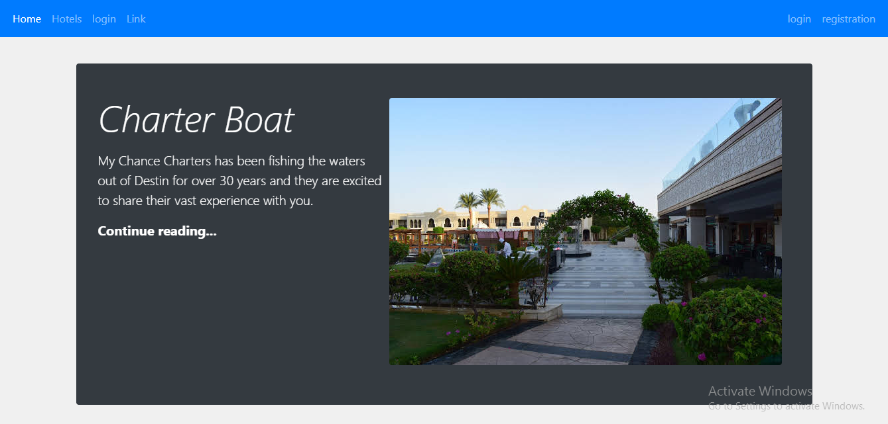
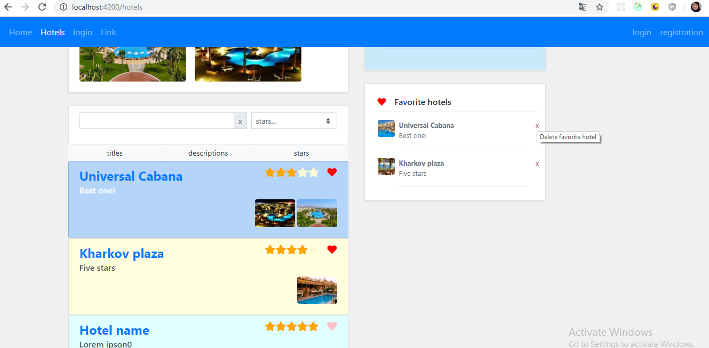
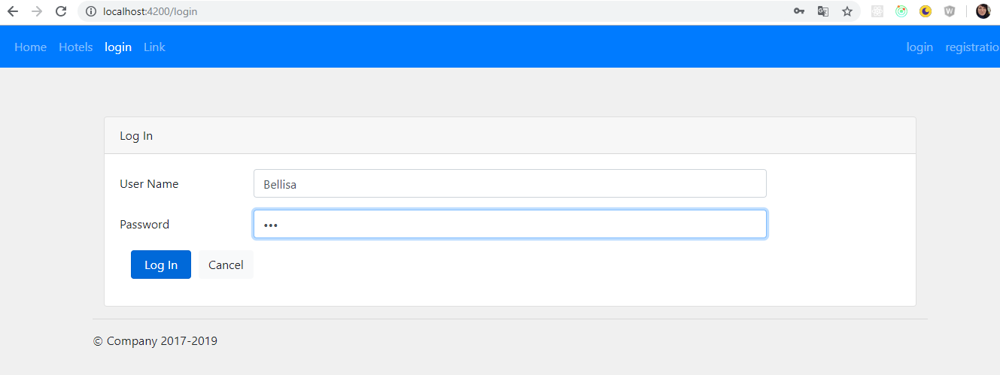
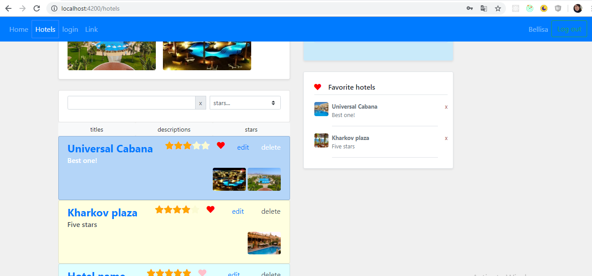

# Hotel App
## About
This project - single page aplication and was generated with [Angular CLI](https://github.com/angular/angular-cli) version 7.3.2.
  
  ## Installation sources
Clone repository
`git clone https://github.com/Bellisa/OK_store.git`
Go to project folder and make
`npm i`

## Development server

Run `npm start` for a dev server. Navigate to `http://localhost:4200/`. The app will automatically reload if you change any of the source files.

## Test data server

Run `npm run jsonserver` for a json server. Navigate to `http://localhost:3000/`. 

## Update sources
Some packages usages might change so you should run npm prune & npm install often. A common way to update is by doing
  `$ git pull`
  `$ npm prune`
  `$ npm install`
## Architecture

### Project scheme

## Code scaffolding

Run `ng generate component component-name` to generate a new component. You can also use `ng generate directive|pipe|service|class|guard|interface|enum|module`.

## Build

Run `ng build` to build the project. The build artifacts will be stored in the `dist/` directory. Use the `--prod` flag for a production build.

## Running unit tests

Run `ng test` to execute the unit tests via [Karma](https://karma-runner.github.io).

## Running end-to-end tests

Run `ng e2e` to execute the end-to-end tests via [Protractor](http://www.protractortest.org/).

## Further help

To get more help on the Angular CLI use `ng help` or go check out the [Angular CLI README](https://github.com/angular/angular-cli/blob/master/README.md).

## License
This sample app is released under by --Bellisa--
